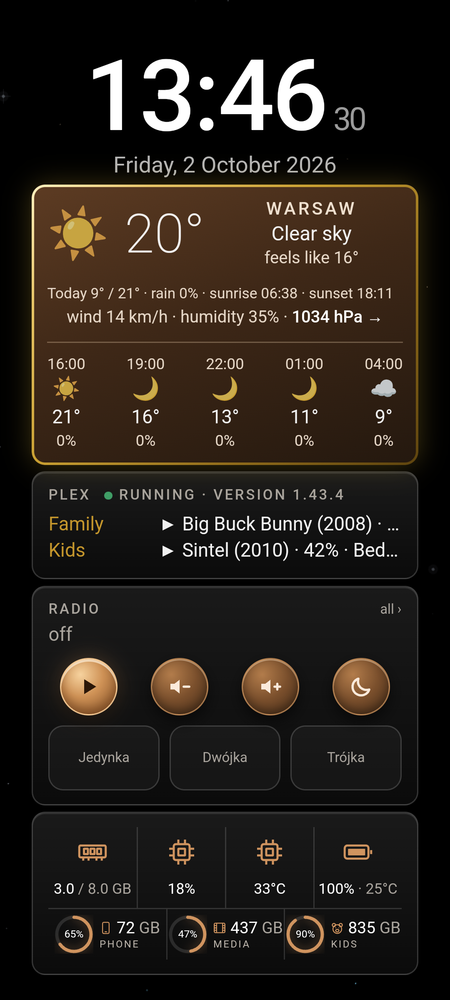
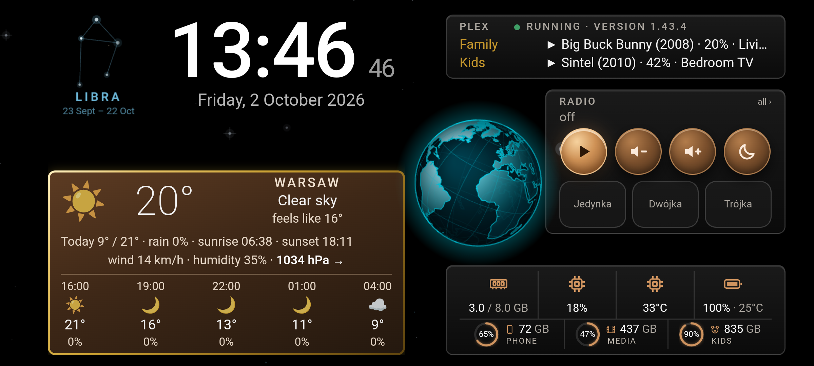
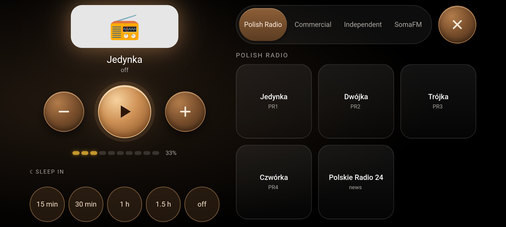

# ♻️ Zero-Cost Plex Server on an Old Android Phone

### No root · No new hardware · Built with Claude AI


An old phone from a drawer (realme GT Master Edition: Snapdragon 778G, 8 GB RAM) plus an old USB drive turned into a **24/7 Plex Media Server for the whole home**. It streams movies and TV shows to TVs, phones and laptops.
**Total hardware cost: €0.** We only used things we already had. The whole setup draws about **2–3 W**.
No root, no custom ROM, no unlocked bootloader. Android stays a normal Android, and the server runs inside the Termux app.
**✅ Tested with 4K and it works:** 4K HEVC 10-bit **HDR10 at 70 Mb/s** streams smoothly to a 2021 Samsung TV via Direct Play, with the phone at 34–36 °C. The phone's drive → Wi-Fi path delivers about 200 Mb/s, so the limit is the TV: at 80 Mb/s the Samsung showed a black screen even though the server was Direct Playing, and a realme Android TV could not start 4K HEVC 10-bit at all (details in [docs/PERFORMANCE.md](docs/PERFORMANCE.md)).

<p align="center">
  
  &nbsp;
  <br>
  <br>
  <sub>The phone's full-screen status dashboard in portrait and landscape, and the radio panel (example data; station logos are not included in the repo). The same page is available to any device on the LAN.</sub>
</p>

---

## Why

| | |
|---|---|
| 💸 **Zero cost** | Reuses a retired phone and a spare drive. No NAS, no mini-PC, no subscription. |
| ♻️ **Upcycling** | Gives e-waste a second life. A mid-range phone from a few years ago is a capable little ARM64 server. |
| 🔌 **Low power** | About 2–3 W for phone + SSD + hub, versus tens of watts for a PC or NAS. |
| 🤫 **Silent, tiny** | No fans, no disks spinning (with an SSD), fits on a shelf. |
| 🔋 **Built-in UPS** | The phone battery keeps the server alive through short power cuts. |
| 🔓 **No root** | Works on a stock, locked phone. Termux + Ubuntu in PRoot. |
| 🩺 **Self-healing** | Watchdogs restart whatever stops: Plex, SSH, the status page, even the whole Termux app. |
| 🔄 **Auto-updates** | Termux, Ubuntu and Plex update themselves every Sunday at 04:00. |
| 📻 **Bonus: a radio** | The same phone plays internet radio (90 stations) through its speaker or a Bluetooth speaker. |

---

## Features

- **Plex Media Server** (official ARM64 `.deb`, updated from the official Plex apt repository) in Ubuntu 26.04 running in PRoot inside Termux.
- **Auto-start after reboot**: SSH, cron, the status page and Plex come back by themselves. Plex answered **76 s** after a reboot command.
- **Self-healing watchdogs that guard each other**: cron guards Plex/SSH/the status page every 5 min, the status app revives Termux when it is killed, and Termux reopens the status app when it is closed.
- **Weekly auto-updates** with an update lock so the watchdog does not fight the updater.
- **Full-screen status dashboard app** (native Android app, ~29 KB). It shows a clock, the date and the current zodiac constellation, the weather with pressure trend and a 3-hour forecast, Plex status and what each user is watching, free space on every drive as **rings** (a second drive and any extra USB drive are picked up automatically), RAM, CPU load and temperature, and battery. Black/copper/gold look with a **spinning holographic Earth** (Natural Earth outlines, Moon on its orbit) and twinkling stars in the background, tuned to cost the phone ~10 CPU points. The screen stays on 06:00–23:00 and goes off at night. AMOLED burn-in protection: dark UI and a pixel shift every minute.
- **Internet radio** in the same app: **90 stations** (Polish, SomaFM, **UK**: Magic, Mellow Magic, Smooth, Heart, Absolute, Greatest Hits, KISS, Jazz FM, Classic FM, BBC Radio 2…, **US** pop, rock and country), played through the phone speaker or a Bluetooth speaker. A radio card on the dashboard with big round buttons and the 3 most-played stations; a full-screen **Radio panel** with "Now playing" (station logo with a matching glow, finger-sized controls, sleep timer) and one scrollable station list with sticky group tabs. Control it from any device on the LAN.
- **Radio that survives failures**: backup stream addresses, the current address from Radio Browser, waiting for the internet to come back and resuming by itself, current Bauer/Rayo addresses fetched from their API, and a **nightly check of every station** (dead ones are greyed out in the panel).
- The **same status page for every device on the LAN** (`http://<phone-ip>:8099`). The Plex token never leaves the phone.
- **LAN-only SSH**, key authentication only, passwords disabled.
- **Network drive on Windows** (SSHFS-Win) for browsing, and `scp` + SHA-256 for large files.
- **Direct Play** to TVs: the phone barely works while streaming. **4K HEVC Direct Play** tested and working.
- **Software transcoding when needed**: measured up to **three 1080p → 720p streams at once** in real time.

---

## Architecture

```
┌──────────────────── Old Android phone (stock, no root) ────────────────────┐
│                                                                            │
│  Termux                                        "Server Status" app         │
│  ├─ sshd ............ :8022  ◄── SSH/SFTP       ├─ full-screen WebView       │
│  ├─ crond ........... watchdogs + updates       │   └─ http://127.0.0.1:8099 │
│  ├─ status-server.py  :8099  ◄── status page    ├─ 06:00/23:00 alarm         │
│  │                    + radio proxy             ├─ starts on boot            │
│  └─ proot-distro → Ubuntu 26.04                 ├─ Termux watchdog           │
│        └─ Plex Media Server :32400              └─ radio player :8098        │
│              ├─ /media/usb1 ── USB drive (exFAT) via USB-C hub (PD)        │
│              └─ /media/usb2 ── optional second drive (e.g. a kids library) │
│                                                                            │
│  Termux:Boot ── runs start-server.sh after every reboot                    │
└────────────────────────────────────────────────────────────────────────────┘
          ▲ Wi-Fi (fixed MAC + DHCP reservation)
          │
   ┌──────┴──────┐   ┌──────────────┐   ┌───────────────────────────────┐
   │ TVs, phones │   │ Any browser  │   │ Windows PC: drive M: (SSHFS),  │
   │ (Plex app)  │   │ :8099 status │   │ scp, ADB (wireless debugging)  │
   └─────────────┘   └──────────────┘   └───────────────────────────────┘
```

More detail: [docs/HOW-IT-WORKS.md](docs/HOW-IT-WORKS.md).

---

## What you need

| Item | Notes |
|---|---|
| An old Android phone | Android 12+, ARM64. Tested on realme GT Master Edition (RMX3363, Android 13, realme UI 4.0, Snapdragon 778G, 8 GB RAM, 256 GB). |
| A USB drive | **exFAT** recommended (the factory format of most portable SSDs; native kernel driver). NTFS works too through the phone's `ntfs-3g` (tested with a second drive: Direct Play to a TV), just slower. An SSD is quieter and uses less power. |
| A USB-C hub with **PD pass-through** | So the phone charges while the drive is connected. |
| Wi-Fi | A decent signal matters (see [docs/LESSONS-LEARNED.md](docs/LESSONS-LEARNED.md)). Ethernet through the hub is even better. |
| A Windows PC (for setup) | `adb` (Android platform-tools), OpenSSH, Git Bash, Python 3. To build the status app: JDK 17 and Android SDK (build-tools 36, platform android-36). |
| A free Plex account | |

---

## Quick start

1. Follow **[docs/INSTALL-FROM-SCRATCH.md](docs/INSTALL-FROM-SCRATCH.md)**. It is step by step, with the exact commands used.
2. Set your values at the top of the scripts: `USB_ID` and `MEDIA_DIR` (and optionally `KIDS_USB_ID` for a second drive) in `scripts/start-server.sh` and `scripts/status-screen/status-server.py`; `CITY`, `LAT`, `LON`, `TZ`, `LANG` and `PLEX_USERS` in `scripts/status-screen/www/index.html`; your phone IP and user in `scripts/windows/fix-drive-M.cmd` and `tools/dev-server.py`. Edit the radio stations in `scripts/status-screen/www/radio.json` if you like.
3. Install the status app: download the ready-made APK from **[Releases](https://github.com/oskarmroczkowski-dev/old-phone-plex-server/releases/latest)**, or build it yourself: [status-app/README.md](status-app/README.md).
4. Run the final tests (reboot, kill Plex, kill Termux) listed at the end of the install guide.

```
git clone https://github.com/oskarmroczkowski-dev/old-phone-plex-server.git
```

---

## Documentation

| Document | What's inside |
|---|---|
| [docs/HOW-IT-WORKS.md](docs/HOW-IT-WORKS.md) | Components, ports, the boot sequence second by second, data flows, watchdogs, updates |
| [docs/INSTALL-FROM-SCRATCH.md](docs/INSTALL-FROM-SCRATCH.md) | Full setup with real commands, from a stock phone to a tested server |
| [docs/OPERATIONS.md](docs/OPERATIONS.md) | Day-to-day: paths, scripts, commands, Android settings, troubleshooting, security, network drive |
| [docs/LESSONS-LEARNED.md](docs/LESSONS-LEARNED.md) | Non-obvious problems we hit, how we diagnosed them and what fixed them |
| [docs/PERFORMANCE.md](docs/PERFORMANCE.md) | Measured transcoding capacity, 4K Direct Play limits, throughput, and how to reproduce the tests |
| [docs/CHANGELOG.md](docs/CHANGELOG.md) | Project timeline |
| [status-app/README.md](status-app/README.md) | The native "Server Status" app: classes, permissions, build without Gradle, install |

Repository layout:
```
scripts/
├── start-server.sh            starts whatever is not running + watchdog (cron every 5 min)
├── update-server.sh           weekly update (Sunday 04:00)
├── termux-boot/10-start-server   run by Termux:Boot after every reboot
├── crontab.txt                Termux cron table
├── ubuntu/start-plex.sh       starts Plex inside Ubuntu (no systemd in PRoot)
├── migrate-plex-paths.sql     example: rewrite Windows library paths after moving a Plex database
├── windows/fix-drive-M.cmd    one-click repair of the network drive on Windows
└── status-screen/             status-server.py, start-status.sh, check-app.sh, check-stations.py,
                               www/ (the dashboard page, radio.json, earth.json)
status-app/                    the native Android app (Java, built without Gradle)
tools/                         on the PC: dev-server.py (preview the page in the emulator), make_earth.py (Earth outlines),
                               stations-uk.py / stations-usa.py (station lists), cpu_once.py
lists/removed-apps-realme.txt  bloatware removed with `pm uninstall --user 0`
```

---

## Measured results

| What | Result |
|---|---|
| Plex reachable after a reboot command | **76 s** |
| Plex crashed (Termux alive) → restarted by cron | ≤ 5 min (test: answering again after 3 min 46 s) |
| Whole Termux force-stopped → revived by the status app | test: **2 min 44 s** (SSH, cron, status page and Plex back) |
| Status page server killed → revived by the status app | test: ~2 min |
| Status app force-stopped → reopened by Termux (daytime) | ≤ 20 min |
| PC → phone over Wi-Fi with SSH encryption (no disk write) | **95.5 MB/s** |
| Phone USB 2.0 port → USB drive (read) | ~27 MB/s (the real bottleneck) |
| Copying a film with `scp` | ~21 MB/s, verified with SHA-256 |
| Power | phone ~0.6–0.8 W into the battery (measured via ADB); whole setup estimated at 2–3 W |
| Idle load | CPU ~95% idle, CPU 31–43 °C, ~3.5 GB RAM available |
| Software transcoding, 1080p H.264 → 720p | 1 stream **1.29×**, 2 at once **~1.5×** each, 3 at once **1.17–1.26×** each (CPU up to 86 %, max 71 °C) |
| Software transcoding, 4K HEVC | 0.1–0.4×: **not possible**, 4K needs Direct Play |
| 4K HEVC 10-bit Direct Play to a 2021 Samsung TV | **HDR10 70 Mb/s and SDR 40 Mb/s: smooth** (phone at 34–38 °C); HDR10 80 Mb/s: black screen; 90 Mb/s: the TV asks for a transcode |
| 4K HEVC 10-bit on a realme Android TV (Android TV 11, 4K panel) | does **not start** (HDR10 and SDR, 40–70 Mb/s); an ordinary 480p H.264 film plays fine (1080p not tested) |
| USB drive → Wi-Fi → client (the Direct Play path) | **25 MB/s ≈ 200 Mb/s** |
| Dashboard animation (Earth 8 fps, stars) | whole phone CPU 15–21 % (6–9 % without it) |
| Radio: internet cut while playing → back by itself | test (emulator): playing again **6 s** after the network returned |
| Nightly check of all 90 radio stations | ~15 s on the phone, all playing (02.10.2026) |

Details and method: [docs/PERFORMANCE.md](docs/PERFORMANCE.md).

---

## 🤖 Built with Claude AI

This project was designed, debugged and documented together with **Claude** (Claude Code by Anthropic), which worked on the phone through ADB and SSH:

- **diagnosis from evidence**: Android `dumpsys`/`logcat`, Plex logs and Windows event logs. For example, it found why Wi-Fi did not reconnect after a reboot and why copies to the network drive froze;
- **watchdog design and failure testing**: killing Plex, force-stopping Termux and rebooting, which uncovered and fixed a stale-lock bug;
- **a native Android app**, written and built **without Gradle** (aapt2 + javac + d8 + apksigner), after the browser route turned out to be a dead end;
- **all of this documentation**.

The human set the goals, made the decisions and approved changes; the AI executed, explained its findings and tested the failure cases. The detailed story is in [docs/LESSONS-LEARNED.md](docs/LESSONS-LEARNED.md).

---

## Limitations

- **No hardware transcoding** without root. Software transcoding handles up to three 1080p → 720p streams, but **4K cannot be transcoded**. Use **Direct Play** (original quality) on TVs. For 4K, the TV must play the file natively: watch for the TV app's bitrate cap, Dolby Vision profile 5 and image-based (PGS) subtitles, all of which force a transcode. Test on your own TVs: in our tests the practical 4K HDR10 limit of a 2021 Samsung TV was 70 Mb/s (its declared cap is 80), and a realme Android TV with a 4K panel could not play 4K HEVC 10-bit at all.
- The phone's **USB-C port is USB 2.0**: ~27 MB/s to the drive. Enough for several streams, slow for bulk copying.
- **Wi-Fi signal matters**: with a weak signal (≈ -80 dBm on 5 GHz) Android will not auto-reconnect after a reboot. Place the phone well, or use Ethernet through the hub.
- **No-root constraints**: no systemd, Docker or firewall, and no ports below 1024 (so no SMB share; SSHFS instead).
- **The phone battery sits at 100 %** all the time. realme UI 4.0 has no permanent charge limit; consider a smart plug.
- If the battery ever fully drains, the phone must be switched on by hand. After that everything comes back automatically.
- **Radio station logos are not included** (they are trademarks). `tools/stations-*.py` download them for your own use; without logos the tiles show the station names. Stream addresses change from time to time: the app has fallbacks, and the nightly check tells you which stations died.

---

*Not affiliated with or endorsed by Plex Inc. "Plex" is a trademark of Plex Inc. Use only media you have the rights to.*

**License:** [MIT](LICENSE)
